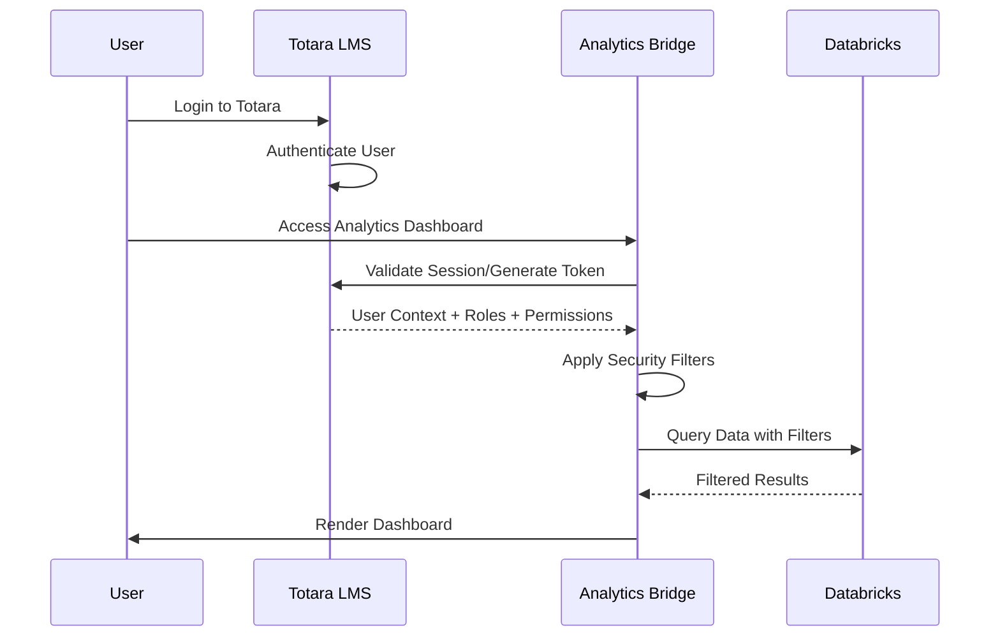

# Kineo Analytics UI Architecture - Totara-Databricks Bridge

## Executive Summary

This document outlines the recommended architecture for building a UI layer that bridges Databricks analytics with Totara LMS, providing seamless authentication and role-based dashboard access. The solution maintains the existing user experience while leveraging Databricks performance improvements and eliminating Sisense dependencies.

## Current State Analysis

### Existing Sisense Integration
- **Dashboard URL**: `/local/analytics/dashboard.php`
- **Totara Plugin**: `local_analytics` with content tracking capabilities
- **Authentication**: Custom capability `local/analytics:viewsisensedashboard`
- **Access Control**: Organization-based and multi-tenant restrictions
- **Update Pattern**: Nightly scheduled tasks via `local_analytics\task\update_data_security_rules`
- **License Constraint**: 3-user limitation

### Current User Roles & Access Patterns
| Totara Role | Access Level | Current Restrictions |
|-------------|--------------|---------------------|
| Site Administrator | Full dashboard access | None |
| Totara Administrators | Requires custom capability | Site-level data |
| Trainers | Limited via audiences | Assigned courses/programs |
| Compliance Managers | Certification focus | Compliance data + reports |
| People Managers | Manager hierarchy | Direct/indirect reports |
| Employees/Learners | Personal view | Own learning data only |

## Proposed Architecture

### High-Level Architecture

```
┌─────────────────┐    ┌──────────────────────┐    ┌─────────────────────┐
│   Totara LMS    │◄──►│   Analytics Bridge   │◄──►│ Databricks Lakehouse│
│                 │    │                      │    │                     │
│ • Authentication│    │ • Flask Application  │    │ • Gold Layer Tables │
│ • User Roles    │    │ • Power BI Embedded  │    │ • 30+ Dimensions    │
│ • Organization  │    │ • Session Management │    │ • 11 Fact Tables    │
│ • Content Flags │    │ • Security Layer     │    │ • Manager Hierarchy │
└─────────────────┘    └──────────────────────┘    └─────────────────────┘
```

### Technology Stack Recommendation

#### **Hybrid Flask + Power BI Embedded Approach**

**Frontend Layer:**
- **Power BI Embedded**: Enterprise-grade visualizations with Row-Level Security (RLS)
- **Flask Templates**: Jinja2 for custom layouts and navigation
- **Bootstrap 5**: Responsive design matching Totara's UI patterns

**Backend Layer:**
- **Flask/Python**: Lightweight web framework with extensive Azure integration
- **SQLAlchemy**: Database ORM for session and configuration management
- **Azure AD Integration**: Enterprise authentication and authorization
- **Databricks SDK**: Direct connection to lakehouse data

**Infrastructure:**
- **Azure App Service**: Scalable hosting with auto-scaling capabilities
- **Azure Database**: PostgreSQL for session management and configuration
- **Azure Key Vault**: Secure storage for connection strings and secrets
- **Azure Application Insights**: Monitoring and performance tracking

## Authentication & Security Architecture

### Session-Based Authentication Flow



### Role-Based Access Control Mapping

#### Security Layer Implementation

1. **Organization Filtering**
   - Maps Totara organization hierarchy to Databricks filters
   - Implements "Show by user's current organisation" logic
   - Supports child organization access patterns

2. **Multi-tenancy Support**
   - Enforces "user visibility restrictions" from Totara
   - Handles tenant isolation mode scenarios
   - Maintains System User vs Tenant Member distinctions

3. **Manager Hierarchy Integration**
   - Leverages 7,794 relationship records from `Dim_Manager_Relationship`
   - Implements transitive closure for indirect reports
   - Supports self, direct, and indirect management relationships

4. **Content Restrictions**
   - Honors "Include in dashboard" flags from Totara
   - Supports both site-level and content-level tracking preferences
   - Maintains backward compatibility with existing configurations

## Dashboard Architecture

### Dashboard Structure Preservation

The new architecture maintains the existing 5-dashboard structure:

1. **Course Completion Dashboard**
   - Completions over time charts
   - Category-level drill-down capabilities
   - Secondary metrics (completion rates, time to complete, overdue courses)
   - Learner details tables with filtering

2. **Program Completion Dashboard**
   - Program completion by category
   - Related course completion tracking
   - Assignment status filtering
   - Multi-level drill-down (category → program → courses)

3. **Certification Completion Dashboard**
   - Certification completion by category
   - Expiry tracking and renewal management
   - Related course completion analysis
   - Assignment status management

4. **Seminar Attendance Dashboard**
   - Training attendance over time
   - Attendance rates by course/seminar
   - No-show tracking and analysis
   - Detailed attendance metrics

5. **Average Learner Hours Dashboard**
   - Time spent in e-Learning (SCORM)
   - Instructor-led training time
   - Average learning time by category
   - Learner engagement metrics

### Data Integration Patterns

#### Real-time Data Access
- **Databricks SQL Connector**: Direct connection to Gold layer tables
- **Caching Strategy**: Redis for frequently accessed aggregations
- **Refresh Schedule**: Maintains nightly update pattern for consistency
- **Performance Optimization**: Pre-calculated metrics for large datasets (92K+ cert_overview records)

#### Security Integration
- **Row-Level Security (RLS)**: Implemented at Power BI level based on user context
- **Dynamic Filtering**: Applied at query time using Databricks parameters
- **Content Flagging**: Honors Totara's "Include in dashboard" selections
- **Audit Logging**: Comprehensive access logging for compliance requirements

## Implementation Architecture

### Application Structure

```
kineo-analytics-bridge/
├── app/
│   ├── __init__.py              # Flask application factory
│   ├── auth/
│   │   ├── totara_auth.py       # Totara session validation
│   │   ├── role_mapper.py       # Role-based access mapping
│   │   └── security_context.py  # User security context management
│   ├── dashboards/
│   │   ├── course_completion.py # Course completion dashboard logic
│   │   ├── program_completion.py# Program completion dashboard logic
│   │   ├── certification.py    # Certification dashboard logic
│   │   ├── seminar_attendance.py# Seminar attendance dashboard logic
│   │   └── learner_hours.py     # Average learner hours dashboard logic
│   ├── api/
│   │   ├── databricks_client.py # Databricks connection and queries
│   │   ├── data_filters.py      # Security filter application
│   │   └── cache_manager.py     # Redis caching implementation
│   ├── models/
│   │   ├── user_session.py      # User session management
│   │   ├── organization.py      # Organization hierarchy models
│   │   └── content_tracking.py  # Content inclusion flags
│   └── utils/
│       ├── power_bi_embed.py    # Power BI embedding utilities
│       ├── security_helpers.py  # Security validation helpers
│       └── config_manager.py    # Configuration management
├── templates/
│   ├── base.html               # Base template matching Totara styling
│   ├── dashboard_layout.html   # Dashboard container template
│   └── components/             # Reusable UI components
├── static/
│   ├── css/                    # Custom stylesheets
│   ├── js/                     # JavaScript for interactivity
│   └── images/                 # Static assets
├── config/
│   ├── development.py          # Development configuration
│   ├── production.py           # Production configuration
│   └── databricks_config.py    # Databricks connection settings
├── migrations/                 # Database schema migrations
├── tests/                      # Unit and integration tests
├── requirements.txt            # Python dependencies
├── Dockerfile                  # Container configuration
└── azure-pipelines.yml        # CI/CD pipeline configuration
```

### Integration Points

#### Totara LMS Integration

1. **Authentication Endpoint**
   ```python
   # New Totara API endpoint for user validation
   /local/analytics/api/validate_user
   ```

2. **Session Management**
   ```python
   # Shared session validation
   def validate_totara_session(session_token):
       # Validate against Totara's session store
       # Return user context with roles and permissions
   ```

3. **URL Replacement**
   ```php
   // Update existing Totara dashboard.php
   // Redirect to new bridge application
   header('Location: https://analytics-bridge.domain.com/dashboard');
   ```

#### Databricks Integration

1. **Connection Configuration**
   ```python
   # Databricks SQL connection
   DATABRICKS_CONFIG = {
       'server_hostname': 'your-workspace.databricks.com',
       'http_path': '/sql/1.0/warehouses/your-warehouse-id',
       'access_token': 'your-access-token'
   }
   ```

2. **Security Filter Application**
   ```sql
   -- Dynamic filtering based on user context
   SELECT * FROM gold.fact_course_progress 
   WHERE user_org_id IN (${user_organization_ids})
   AND course_id IN (${allowed_course_ids})
   ```

## Performance Considerations

### Optimization Strategies

1. **Query Performance**
   - **Target**: 2-3 second response times (15x improvement over Sisense)
   - **Implementation**: Pre-aggregated views in Databricks Gold layer
   - **Caching**: Redis for dashboard configurations and user contexts

2. **Scalability**
   - **Auto-scaling**: Azure App Service automatic scaling based on demand
   - **Load Balancing**: Azure Load Balancer for high availability
   - **Connection Pooling**: Databricks connection pool management

3. **Data Volume Handling**
   - **Large Tables**: Optimized queries for cert_overview (92K+ records)
   - **Pagination**: Implement pagination for learner details tables
   - **Lazy Loading**: Progressive data loading for dashboard components

## Security Considerations

### Data Protection

1. **Encryption**
   - **In Transit**: HTTPS/TLS 1.3 for all communications
   - **At Rest**: Azure Key Vault for secrets management
   - **Database**: Encrypted connections to Databricks and PostgreSQL

2. **Access Control**
   - **Authentication**: Integration with Totara's existing authentication
   - **Authorization**: Role-based access control with fine-grained permissions
   - **Audit**: Comprehensive logging of all data access

3. **Compliance**
   - **GDPR**: Data privacy controls and user data management
   - **SOC 2**: Enterprise-grade security controls
   - **Data Residency**: Azure region selection for compliance requirements

## Migration Strategy

### Phase 1: Foundation (Weeks 1-4)
- Set up Azure infrastructure and development environment
- Implement basic Flask application with Totara authentication
- Create database schema for session and configuration management
- Develop core security middleware and role mapping

### Phase 2: Dashboard Implementation (Weeks 5-12)
- Implement Power BI embedded dashboards
- Develop Databricks integration layer
- Create security filtering logic
- Build dashboard-specific views and controllers

### Phase 3: Testing & Optimization (Weeks 13-16)
- Comprehensive testing across all user roles
- Performance optimization and caching implementation
- Security penetration testing
- User acceptance testing with key stakeholders

### Phase 4: Deployment & Cutover (Weeks 17-20)
- Production deployment and configuration
- Parallel running with existing Sisense system
- Data validation and comparison testing
- Final cutover and Sisense decommissioning

## Success Metrics

### Performance Targets
- **Query Response Time**: < 3 seconds (15x improvement)
- **Dashboard Load Time**: < 5 seconds
- **Concurrent Users**: Support 50+ concurrent users (vs 3-license limit)
- **Uptime**: 99.9% availability SLA

### Cost Benefits
- **Infrastructure**: 47% cost reduction vs Sisense
- **Licensing**: No per-user licensing costs
- **Maintenance**: Reduced vendor dependencies
- **Scalability**: Elastic scaling based on demand

## Risk Mitigation

### Technical Risks
1. **Integration Complexity**: Phased implementation with rollback capabilities
2. **Performance Issues**: Comprehensive load testing and optimization
3. **Security Vulnerabilities**: Security audits and penetration testing
4. **Data Consistency**: Parallel validation during transition period

### Operational Risks
1. **User Adoption**: Maintain familiar UI patterns and workflows
2. **Training Requirements**: Minimal due to preserved user experience
3. **Support Model**: Documented runbooks and monitoring dashboards
4. **Rollback Plan**: Ability to revert to Sisense if critical issues arise

## Conclusion

This architecture provides a robust, scalable solution that bridges Databricks analytics with Totara LMS while maintaining the existing user experience. The hybrid Flask + Power BI approach leverages enterprise-grade tools while providing the flexibility to customize the integration to meet Kineo's specific requirements.

The solution addresses all current functional requirements while providing significant performance improvements, cost savings, and future scalability. The phased implementation approach ensures minimal risk while allowing for continuous validation and optimization throughout the migration process.