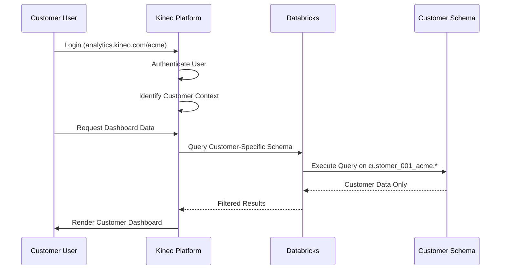

# Kineo Analytics Platform Architecture - Standalone Multi-Customer SaaS

## Executive Summary

This document outlines the architecture for Kineo's standalone analytics platform - a multi-customer SaaS solution that Kineo owns and hosts. The platform provides interactive dashboards and drill-down capabilities directly to customers without requiring any BI tool dependencies or tight coupling with learning management systems. The solution leverages Databricks for high-performance analytics while providing a modern web-based visualization experience.

## Strategic Vision

### Key Principles
1. **Kineo-Owned Platform**: Complete control over features, UI/UX, and product roadmap
2. **BI-Tool Agnostic**: No dependency on customer BI tools or licensing
3. **Multi-Customer SaaS**: Scalable architecture supporting hundreds of customers
4. **Minimal Integration**: Lightweight data ingestion from various sources
5. **Standalone Experience**: Customers access analytics directly via web platform

### Business Model
- **SaaS Subscription**: Revenue model based on customer subscriptions
- **White-label Ready**: Kineo branding with optional customer customization
- **Scalable Infrastructure**: Cloud-native architecture for rapid customer onboarding

## Current State Analysis

### Existing Sisense Model (To Be Replaced)
- **Embedded Approach**: Sisense dashboards embedded within Totara
- **Tight Coupling**: Heavy integration with Totara authentication and roles
- **Customer Limitations**: 3-user licensing constraints
- **Vendor Lock-in**: Dependency on proprietary Sisense technology
- **Limited Scalability**: Difficult to extend to non-Totara data sources

### Limitations of Current Approach
- **Vendor Lock-in**: Heavy dependency on proprietary Sisense technology
- **Tight System Coupling**: Deep integration with Totara authentication and roles
- **Limited Scalability**: 3-user licensing constraints restrict customer access
- **Single Data Source**: Difficult to extend beyond Totara to other learning systems
- **Maintenance Overhead**: Complex embedded integration increases support complexity

## Proposed Architecture

### High-Level Platform Architecture

```
Customer Access      Kineo Analytics Platform      Databricks Lakehouse           Data Sources
┌─────────────────┐  ┌──────────────────────────┐  ┌─────────────────────────┐   ┌─────────────────┐
│ Customer 1      │  │                          │  │                         │  ┌┤ Customer 1 Data │
│ • Direct Login  │──│   Visualization Layer    │──│   Data & Compute Layer  │──│ Totara Instance │
│ • analytics.    │  │                          │  │                         │  ││ HRIS Systems    │
│   kineo.com/c1  │  │ • Interactive Charts     │  │ customer_001_acme/      │  ││ Custom Sources  │
└─────────────────┘  │ • Drill-down Navigation  │  │ ├── gold.dim_users      │  │└─────────────────┘
                     │ • Advanced Filtering     │  │ ├── gold.fact_progress  │  │
┌─────────────────┐  │ • Export Capabilities    │  │ └── gold.fact_certs     │  │┌─────────────────┐
│ Customer 2      │──│                          │  │                         │──├┤ Customer 2 Data │
│ • Direct Login  │  │   Query Engine           │  │ customer_002_techcorp/  │  ││ Totara Instance │
│ • analytics.    │  │                          │  │ ├── gold.dim_users      │  ││ CSV Uploads     │
│   kineo.com/c2  │  │ • Dynamic SQL Generation │  │ ├── gold.fact_progress  │  ││ API Feeds       │
└─────────────────┘  │ • Customer Isolation     │  │ └── gold.fact_certs     │  │└─────────────────┘
                     │ • Caching & Performance  │  │                         │  │
┌─────────────────┐  │ • Role-based Security    │  │ Schema Per Customer:    │  │┌─────────────────┐
│ Customer N...   │──│                          │  │ • Complete Isolation    │──└┤ Customer N Data │
└─────────────────┘  └──────────────────────────┘  │ • Auto-scaling Compute  │   └─────────────────┘
                                                   │ • Medallion Architecture│
                                                   └─────────────────────────┘
```

### **Two-Layer Architecture Explanation**

#### **Layer 1: Databricks (Data & Compute Layer)**
- **Purpose**: Data warehouse and computation engine
- **Responsibilities**: 
  - Store all customer data in isolated schemas
  - Process complex analytical queries
  - Handle data transformations and business logic
  - Provide auto-scaling compute resources

#### **Layer 2: Kineo Platform (Visualization Layer)**  
- **Purpose**: Interactive dashboard and user experience
- **Responsibilities**:
  - Generate dynamic SQL queries based on user interactions
  - Render interactive charts and visualizations
  - Handle user authentication and multi-tenancy
  - Cache frequently accessed data for performance

### Technology Stack

#### **Frontend: Modern Interactive Web Application**
- **React + TypeScript**: Component-based architecture for maintainable UI
- **D3.js**: Custom interactive charts with drill-down capabilities
- **Recharts**: Pre-built responsive chart components for rapid development
- **Material-UI**: Professional dashboard framework with consistent design
- **React Query**: Efficient data fetching, caching, and synchronization
- **React Router**: Multi-customer routing and navigation

#### **Backend: High-Performance Multi-Tenant API**
- **FastAPI (Python)**: High-performance async API with automatic documentation
- **SQLAlchemy**: ORM for customer configurations and metadata management
- **Databricks SDK**: Direct high-performance connection to customer data
- **Pydantic**: Data validation and serialization for API contracts
- **Alembic**: Database migrations for platform schema evolution

#### **Infrastructure: Cloud-Native Scalability**
- **Azure App Service**: Auto-scaling web hosting with multiple deployment slots
- **Azure Database for PostgreSQL**: Customer configurations and user management
- **Azure Cache for Redis**: High-performance caching layer
- **Azure CDN**: Global content delivery for optimal performance
- **Azure Key Vault**: Secure credential and connection string management
- **Azure Application Insights**: Comprehensive monitoring and analytics

## Databricks Integration Architecture

### **Data Flow: Source to Visualization**

```
Data Sources → Databricks Lakehouse → Kineo Platform → Customer Dashboards
```

#### **Step 1: Data Ingestion to Databricks**
```python
# ETL Pipeline Example
def ingest_customer_data(customer_id: str, source_data: Any):
    # 1. Land data in Bronze layer (raw)
    bronze_table = f"customer_{customer_id:03d}.bronze.raw_totara_data"
    
    # 2. Clean and standardize in Silver layer  
    silver_query = f"""
    CREATE OR REPLACE TABLE customer_{customer_id:03d}.silver.course_progress AS
    SELECT user_id, course_id, completion_date, progress_percent
    FROM customer_{customer_id:03d}.bronze.raw_totara_data
    WHERE completion_date IS NOT NULL
    """
    
    # 3. Create analytics-ready Gold layer
    gold_query = f"""
    CREATE OR REPLACE TABLE customer_{customer_id:03d}.gold.fact_course_progress AS
    SELECT cp.*, u.organization_id, c.category_id
    FROM customer_{customer_id:03d}.silver.course_progress cp
    JOIN customer_{customer_id:03d}.gold.dim_users u ON cp.user_id = u.user_id
    JOIN customer_{customer_id:03d}.gold.dim_courses c ON cp.course_id = c.course_id
    """
```

#### **Step 2: Query Generation by Kineo Platform**
```python
# Dashboard Controller Example
class CourseCompletionDashboard:
    async def get_completion_data(self, customer_id: str, filters: dict):
        # Generate customer-specific SQL
        schema = f"customer_{customer_id:03d}"
        query = f"""
        SELECT 
            c.category_name,
            COUNT(*) as total_enrollments,
            SUM(CASE WHEN cp.completion_date IS NOT NULL THEN 1 ELSE 0 END) as completions,
            ROUND(SUM(CASE WHEN cp.completion_date IS NOT NULL THEN 1 ELSE 0 END) * 100.0 / COUNT(*), 2) as completion_rate
        FROM {schema}.gold.fact_course_progress cp
        JOIN {schema}.gold.dim_courses c ON cp.course_id = c.course_id
        JOIN {schema}.gold.dim_users u ON cp.user_id = u.user_id
        WHERE cp.enrollment_date BETWEEN '{filters.start_date}' AND '{filters.end_date}'
        """
        
        # Execute against Databricks
        results = await databricks_client.execute_query(query)
        
        # Transform for frontend visualization
        return self.format_for_charts(results)
```

### Customer Isolation Strategy

#### **Schema-Per-Customer Model in Databricks**
```sql
-- Databricks workspace structure
databricks_lakehouse/
├── customer_001_acme/              # Complete data isolation
│   ├── bronze/                     # Raw data layer
│   │   ├── raw_totara_exports
│   │   └── raw_csv_uploads
│   ├── silver/                     # Cleansed data layer
│   │   ├── standardized_users
│   │   ├── cleaned_courses
│   │   └── validated_progress
│   └── gold/                       # Analytics-ready layer
│       ├── dim_users               # User dimension
│       ├── dim_courses             # Course dimension
│       ├── fact_course_progress    # Learning progress facts
│       └── fact_certifications     # Certification facts
├── customer_002_techcorp/          # Separate customer schema
│   └── [same medallion structure...]
└── platform_shared/               # Platform metadata only
    ├── customer_configs
    └── data_lineage_tracking
```

### Authentication & Security Architecture

#### **Multi-Tenant Authentication Flow**


#### **Security Layers**

1. **Customer Isolation**
   - **URL-based**: Each customer accesses via unique subdomain/path
   - **Schema Isolation**: Complete data separation at database level
   - **Token-based**: JWT tokens with customer context embedded
   - **Network Isolation**: Optional VPN/private endpoint connections

2. **Role-Based Access Control**
   - **Customer Admin**: Full access to customer's data and user management
   - **Manager**: Access to team/department data based on hierarchy
   - **Analyst**: Read-only access to assigned data sets
   - **Learner**: Personal dashboard with own learning data

3. **Data Access Patterns**
   ```python
   # Automatic customer filtering at query level
   async def get_course_completions(customer_id: str, user_context: UserContext):
       schema = f"customer_{customer_id:03d}"
       query = f"""
       SELECT * FROM {schema}.gold.fact_course_progress
       WHERE user_access_level <= {user_context.access_level}
       AND organization_id IN ({user_context.allowed_orgs})
       """
   ```

## Interactive Dashboard Architecture

### Modern Visualization Capabilities

#### **Core Dashboard Features**
1. **Interactive Drill-Down**
   - Click charts to drill from summary → detailed views
   - Breadcrumb navigation for easy back-tracking  
   - Cross-chart filtering (select organization → all charts update)
   - Contextual tooltips with detailed metrics

2. **Advanced Filtering System**
   ```javascript
   // Dynamic filter state management
   {
     dateRange: { start: '2024-01-01', end: '2024-12-31' },
     organizations: ['Sales', 'Marketing', 'Engineering'],
     courseCategories: ['Compliance', 'Technical Skills'],
     completionStatus: ['completed', 'in-progress', 'overdue'],
     managers: ['John Smith', 'Jane Doe'],
     customFilters: { department: 'IT', region: 'EMEA' }
   }
   ```

3. **Export & Sharing**
   - CSV/Excel export of filtered data
   - Scheduled email reports
   - Shareable dashboard URLs with embedded filters
   - API endpoints for customer integrations

#### **Dashboard Types & Capabilities**

1. **Learning Progress Analytics**
   - Course completion rates with time-series analysis
   - Program progress tracking across multiple dimensions
   - Certification status and renewal management
   - Interactive learner journey visualization

2. **Performance Dashboards**
   - Manager hierarchy performance views
   - Department/team comparison analytics
   - Learning time analysis and optimization
   - Engagement scoring and trends

3. **Operational Dashboards**
   - Training session attendance tracking
   - Resource utilization analysis
   - Compliance reporting and alerts
   - Real-time learning activity monitoring

### Visualization Component Architecture

#### **Reusable Chart Components**
```typescript
// Example React component structure
interface ChartProps {
  data: any[];
  customerConfig: CustomerConfig;
  onDrillDown?: (context: DrillDownContext) => void;
  filters: FilterState;
  exportable?: boolean;
}

<CompletionTrendChart 
  data={completionData}
  onDrillDown={(period) => showDetailedView(period)}
  filters={activeFilters}
  customerConfig={customer.chartSettings}
/>

<LearnerProgressTable
  data={learnerData}
  pagination={true}
  sortable={true}
  exportable={true}
  customColumns={customer.tableColumns}
/>

<OrganizationHierarchyTree
  data={orgData}
  onNodeClick={(org) => applyOrgFilter(org)}
  expandLevel={2}
/>
```

#### **Dynamic Visualization Building**
- **Chart Builder**: Drag-and-drop interface for custom visualizations
- **Template System**: Pre-built dashboard templates by industry/use-case
- **Custom Metrics**: Customer-defined KPIs and calculated fields
- **Responsive Design**: Optimized for desktop, tablet, and mobile access

## Data Integration Architecture

### Flexible Data Ingestion

#### **Multi-Source Data Integration**
1. **Totara LMS Integration** (Primary)
   - **API-based**: RESTful endpoints for real-time data sync
   - **Scheduled ETL**: Nightly batch processing for full data refresh
   - **Change Detection**: Delta sync for modified records only
   - **Minimal Coupling**: Optional integration - not required

2. **Alternative Data Sources**
   - **CSV Upload**: Web interface for manual data uploads
   - **SFTP/FTP**: Automated file-based data ingestion
   - **Database Direct**: Direct connection to customer databases
   - **API Integration**: Connect to HRIS, CRM, or custom systems
   - **Webhook Support**: Real-time data push from external systems

3. **Data Transformation Pipeline**
   ```python
   # Flexible ETL pipeline for any source
   def transform_customer_data(source_type: str, raw_data: Any) -> GoldLayerData:
       if source_type == 'totara':
           return transform_totara_data(raw_data)
       elif source_type == 'csv_upload':
           return transform_csv_data(raw_data)
       elif source_type == 'hris':
           return transform_hris_data(raw_data)
       # Add new sources as needed
   ```

### Performance & Caching Strategy

#### **High-Performance Data Access**
- **Databricks SQL Warehouses**: Dedicated compute for customer queries
- **Redis Caching**: Multi-level caching for dashboard performance
- **Pre-aggregated Views**: Common metrics calculated ahead of time
- **Query Optimization**: Automatic query optimization and indexing

#### **Scalability Patterns**
- **Auto-scaling**: Dynamic resource allocation based on customer load
- **Connection Pooling**: Efficient database connection management
- **CDN Integration**: Static asset delivery via Azure CDN
- **Load Balancing**: Multi-region deployment for global customers

## Implementation Architecture

### Application Structure

```
kineo-analytics-platform/
├── backend/
│   ├── app/
│   │   ├── __init__.py              # FastAPI application factory
│   │   ├── auth/
│   │   │   ├── multi_tenant.py      # Multi-customer authentication
│   │   │   ├── jwt_handler.py       # JWT token management
│   │   │   └── permissions.py       # Role-based access control
│   │   ├── api/
│   │   │   ├── dashboards.py        # Dashboard data endpoints
│   │   │   ├── customers.py         # Customer management APIs
│   │   │   ├── users.py             # User management APIs
│   │   │   └── data_export.py       # Export functionality
│   │   ├── core/
│   │   │   ├── databricks.py        # Databricks SDK integration
│   │   │   ├── cache.py             # Redis caching layer
│   │   │   ├── database.py          # Database connection management
│   │   │   └── config.py            # Configuration management
│   │   ├── models/
│   │   │   ├── customer.py          # Customer data models
│   │   │   ├── user.py              # User and role models
│   │   │   ├── dashboard.py         # Dashboard configuration models
│   │   │   └── analytics.py         # Analytics data models
│   │   ├── services/
│   │   │   ├── data_ingestion.py    # Multi-source data ingestion
│   │   │   ├── query_engine.py      # Dynamic query generation
│   │   │   ├── visualization.py     # Chart data preparation
│   │   │   └── export_service.py    # Data export services
│   │   └── utils/
│   │       ├── security.py          # Security utilities
│   │       ├── validators.py        # Data validation
│   │       └── helpers.py           # Common utilities
│   ├── migrations/                  # Database migrations
│   ├── tests/                       # Backend tests
│   ├── requirements.txt             # Python dependencies
│   └── Dockerfile                   # Backend container
├── frontend/
│   ├── src/
│   │   ├── components/
│   │   │   ├── charts/              # Reusable chart components
│   │   │   ├── dashboards/          # Dashboard page components
│   │   │   ├── common/              # Shared UI components
│   │   │   └── forms/               # Form components
│   │   ├── pages/
│   │   │   ├── Dashboard.tsx        # Main dashboard page
│   │   │   ├── CustomerAdmin.tsx    # Customer administration
│   │   │   └── Settings.tsx         # User settings
│   │   ├── hooks/
│   │   │   ├── useAuth.ts           # Authentication hooks
│   │   │   ├── useData.ts           # Data fetching hooks
│   │   │   └── useFilters.ts        # Filter management hooks
│   │   ├── services/
│   │   │   ├── api.ts               # API client
│   │   │   ├── auth.ts              # Authentication service
│   │   │   └── cache.ts             # Client-side caching
│   │   ├── types/                   # TypeScript type definitions
│   │   ├── utils/                   # Utility functions
│   │   └── App.tsx                  # Main application component
│   ├── public/                      # Static assets
│   ├── package.json                 # Node.js dependencies
│   └── Dockerfile                   # Frontend container
├── infrastructure/
│   ├── azure-pipelines.yml          # CI/CD pipeline
│   ├── terraform/                   # Infrastructure as Code
│   │   ├── main.tf                  # Main infrastructure configuration
│   │   ├── database.tf              # Database resources
│   │   ├── app-service.tf           # App service configuration
│   │   └── variables.tf             # Configuration variables
│   └── docker-compose.yml           # Local development environment
└── docs/
    ├── api/                         # API documentation
    ├── deployment/                  # Deployment guides
    └── user-guides/                 # User documentation
```

### Integration Strategy

#### **Lightweight Totara Integration (Optional)**

1. **API-Based Data Sync**
   ```python
   # Optional Totara data synchronization
   async def sync_totara_data(customer_config: TotaraConfig):
       # Fetch learning data via Totara APIs
       # Transform to standard analytics schema
       # Store in customer-specific Databricks schema
   ```

2. **Flexible Authentication Options**
   - **Standalone**: Platform manages users independently
   - **SSO Integration**: SAML/OAuth if customer requires single sign-on
   - **API Key**: Simple authentication for data sync only
   - **Hybrid**: Mix of approaches based on customer needs

#### **Multi-Source Data Integration**

1. **Databricks Connection Management**
   ```python
   # Dynamic customer schema access
   class CustomerDataAccess:
       def __init__(self, customer_id: str):
           self.schema = f"customer_{customer_id:03d}"
           self.connection = get_databricks_connection()
       
       async def query_learning_data(self, query_template: str, filters: dict):
           # Apply customer schema and security filters
           final_query = query_template.format(
               schema=self.schema,
               filters=self._build_where_clause(filters)
           )
   ```

2. **Data Source Flexibility**
   ```python
   # Support multiple data sources per customer
   SUPPORTED_SOURCES = {
       'totara': TotaraConnector,
       'csv_upload': CSVProcessor, 
       'hris': HRISConnector,
       'database': DatabaseConnector,
       'api_webhook': WebhookReceiver
   }
   ```

## Performance & Scalability

### Performance Targets

| Metric | Current (Sisense) | Target (Kineo Platform) | Improvement |
|--------|-------------------|--------------------------|-------------|
| **Dashboard Load Time** | 10-15 seconds | 2-3 seconds | 5x improvement |
| **Query Response** | 5-30 seconds | 1-3 seconds | 10x improvement |
| **Concurrent Users** | 3 users max | 100+ users | No limits |
| **Customer Onboarding** | Weeks | Hours | Rapid deployment |

### Multi-Customer Scalability

1. **Infrastructure Scaling**
   - **Auto-scaling**: Dynamic resource allocation based on customer load
   - **Multi-region**: Global deployment for performance optimization
   - **CDN Integration**: Static content delivery via Azure CDN
   - **Database Sharding**: Customer data isolation with performance optimization

2. **Performance Optimization**
   ```python
   # Example caching strategy
   @cache(ttl=300)  # 5-minute cache for dashboard data
   async def get_dashboard_data(customer_id: str, dashboard_type: str, filters: dict):
       # Generate cache key based on customer + filters
       cache_key = f"dashboard:{customer_id}:{dashboard_type}:{hash(filters)}"
       # Return cached data or query Databricks
   ```

3. **Query Optimization**
   - **Pre-aggregated Views**: Common metrics calculated in advance
   - **Intelligent Caching**: Redis-based multi-layer caching
   - **Connection Pooling**: Efficient Databricks connection management
   - **Lazy Loading**: Progressive data loading for large datasets

## Security & Compliance

### Enterprise Security Model

1. **Multi-Tenant Security**
   - **Customer Isolation**: Complete data separation at schema level
   - **Network Security**: Optional VPN/private endpoint connections
   - **Access Controls**: JWT-based authentication with customer context
   - **Audit Logging**: Comprehensive access logging per customer

2. **Data Protection**
   - **Encryption in Transit**: TLS 1.3 for all API communications
   - **Encryption at Rest**: Azure Key Vault for credential management
   - **Database Security**: Encrypted Databricks and PostgreSQL connections
   - **Backup Security**: Encrypted automated backups with retention policies

3. **Compliance Framework**
   - **GDPR**: Built-in data privacy controls and user rights management
   - **SOC 2**: Enterprise security controls and annual audits
   - **ISO 27001**: Information security management system compliance
   - **Data Residency**: Configurable Azure regions per customer requirements

### Security Implementation

```python
# Example security middleware
class CustomerSecurityMiddleware:
    async def __call__(self, request: Request, call_next):
        # Extract customer context from JWT token
        customer_context = extract_customer_context(request)
        
        # Validate customer access and permissions
        if not validate_customer_access(customer_context):
            raise HTTPException(403, "Insufficient permissions")
            
        # Add security headers and customer context
        request.state.customer = customer_context
        response = await call_next(request)
        
        # Log access for audit trail
        log_customer_access(customer_context, request, response)
        return response
```

## Implementation Strategy

### Development Phases

#### **Phase 1: Platform Foundation (Weeks 1-8)**
- **Infrastructure Setup**: Azure resources and multi-tenant architecture
- **Core Backend**: FastAPI application with customer isolation
- **Authentication System**: JWT-based multi-customer authentication
- **Database Design**: Customer metadata and user management
- **Basic Frontend**: React application structure and routing

#### **Phase 2: Visualization Engine (Weeks 9-16)**
- **Chart Components**: D3.js/Recharts interactive visualization library
- **Dashboard Framework**: Reusable dashboard components and layouts
- **Data Integration**: Databricks SDK integration and query engine
- **Caching Layer**: Redis implementation for performance
- **Customer Onboarding**: Self-service customer setup workflows

#### **Phase 3: Advanced Features (Weeks 17-24)**
- **Drill-down Capabilities**: Interactive chart navigation and filtering
- **Export Features**: CSV/Excel export and scheduled reports
- **Data Ingestion**: Multi-source data connector framework
- **Performance Optimization**: Caching strategies and query optimization
- **Admin Features**: Customer management and configuration tools

#### **Phase 4: Production & Scale (Weeks 25-32)**
- **Production Deployment**: Multi-region Azure deployment
- **Customer Migration**: Gradual migration from existing solutions
- **Performance Tuning**: Load testing and optimization
- **Documentation**: User guides and API documentation
- **Support Framework**: Customer support and monitoring systems

### Customer Onboarding Strategy

```python
# Example customer onboarding workflow
class CustomerOnboarding:
    async def create_customer(self, customer_data: dict):
        # 1. Create customer schema in Databricks
        await self.create_databricks_schema(customer_data['name'])
        
        # 2. Set up customer configuration
        customer = await self.create_customer_record(customer_data)
        
        # 3. Generate initial admin user
        admin_user = await self.create_admin_user(customer.id)
        
        # 4. Initialize default dashboards
        await self.setup_default_dashboards(customer.id)
        
        # 5. Send welcome email with login details
        await self.send_welcome_email(admin_user, customer)
```

## Business Value & Success Metrics

### Platform Success Targets

| Category | Metric | Target | Business Impact |
|----------|---------|---------|-----------------|
| **Performance** | Dashboard load time | < 3 seconds | Improved user experience |
| **Scalability** | Concurrent users | 1000+ users | No licensing constraints |
| **Customer Growth** | Customer onboarding | < 1 day | Rapid revenue expansion |
| **Reliability** | Platform uptime | 99.9% SLA | Enterprise-grade reliability |

### Revenue Opportunities

1. **SaaS Subscription Model**
   - **Tiered Pricing**: Basic, Professional, Enterprise tiers
   - **Per-Customer Licensing**: Predictable recurring revenue
   - **Usage-Based Scaling**: Additional revenue from data volume/users
   - **Professional Services**: Implementation and customization services

2. **Market Expansion**
   - **Multi-Industry**: Extend beyond learning to HR analytics
   - **Global Reach**: Multi-region deployment capabilities
   - **Partner Ecosystem**: Integration marketplace for third-party connectors

### Competitive Advantages

- **No BI Tool Dependencies**: Eliminates customer procurement barriers
- **Rapid Deployment**: Hours vs weeks for customer onboarding
- **Full Control**: Complete ownership of product roadmap and features
- **Flexible Integration**: Support any data source, not just Totara
- **Modern Technology**: Future-proof architecture with latest frameworks

## Conclusion

This architecture represents a strategic shift to a Kineo-owned, standalone analytics platform that eliminates vendor dependencies while providing superior performance and scalability. The multi-customer SaaS approach enables rapid growth and recurring revenue while maintaining complete control over the product experience.

### Key Strategic Benefits

1. **Complete Platform Ownership**: Full control over features, roadmap, and customer experience
2. **Scalable Architecture**: Support hundreds of customers with isolated, secure data access  
3. **Technology Independence**: No dependency on customer BI tools or third-party visualization platforms
4. **Flexible Integration**: Support multiple data sources beyond Totara with lightweight coupling
5. **Modern Technology Stack**: React/TypeScript frontend with FastAPI backend for maintainability

### Implementation Readiness

The architecture is designed for phased implementation with clear milestones and success criteria. The 32-week development timeline provides a realistic path to market while ensuring enterprise-grade quality and security.

The platform positions Kineo as a leading provider of learning analytics solutions with the flexibility to expand into broader HR and organizational analytics markets.